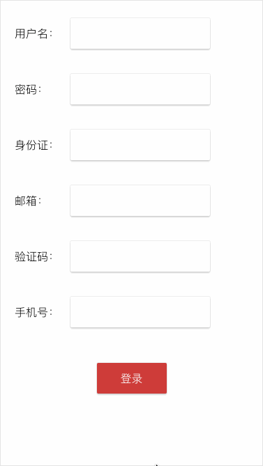

## 仓库

http://gitlab.ndmicro.net/ndmicro-web/vue-validator.git


## 安装

```bash
npm install vue-plugin-validator
```


## 快速开始

```javascript
// main.js

import Vue from 'vue'
import Validator from 'vue-plugin-validator'
 
Vue.use(validator)
```


```vue
// App.vue
<template xmlns:v-verify="http://www.w3.org/1999/xhtml">
    <div>
        <div><label for="username">用户名：</label><input id="username" type="text" v-verify:username.required.sync="{group: 'login'}" v-model="username"></div>
        <div><label for="password">手机号：</label><input id="password" type="text" v-verify:password.required="{group: 'login'}" v-model="password"></div>
        <button @click="commit">登录</button>
    </div>
</template>

<script>
    export default {
        name: "demo",
        data() {
            return {
                username: '',
                password: '',
            }
        },
        methods: {
            commit() {
                const isAvaliable = this.$verify.validate('login')
                if (isAvaliable) {
                    // login option...
                }
            }
        }
    }
</script>

<style scoped lang="less">
    label {
        display: inline-block;
        width: 80px;
    }
    input {
        box-sizing: border-box;
        background: #fff;
        border-radius: 2px;
        border: none;
        box-shadow: 0 2px 2px 0 rgba(0, 0, 0, 0.16), 0 0 0 1px rgba(0, 0, 0, 0.08);
        height: 44px;
        margin: 20px auto;
        width: 200px;
        outline: none;
    }

    button {
        display: block;
        box-sizing: border-box;
        background: #CE3C39;
        color: #fff;
        border-radius: 2px;
        border: none;
        box-shadow: 0 2px 2px 0 rgba(0, 0, 0, 0.16), 0 0 0 1px rgba(0, 0, 0, 0.08);
        height: 44px;
        margin: 20px auto;
        width: 100px;
    }
</style>
```


## 使用

**# 安装插件**：`Vue.use(validator[, options])`

- **参数**：
  - `{Object} options`
    - `{Boolean}  blur `  是否在失去焦点时检验，默认为`true`
    - `{Boolean}  errorToast `  是否需要错误提示，默认为`false`
    - `{Boolean}  warnBorder `  是否需要警告边框，默认为`true`
    - `{Object} customRules`  自定义规则

- **用法**：
  该插件内置了常用的校验策略，如需使用内置校验策略之外的校验策略，可在customRules中列出。

- **示例**：
  ```javascript
  Vue.use(validator, {
      blur: false,
      warnBorder: true,
      errorToast: true,
      customRules: {
      	mobilePhone: {
              rule: new RegExp('^1(3|4|5|7|8)\\d{9}$'),
              msg: '无效的手机号'
          }
      }
  })
  ```


**# 指令**：`v-verify`

- **参数**：`strategy` 检验策略

- **修饰符**：
  - `.required`  为必填项
  - `.focus`  获取焦点时忽略检查
  - `.sync`  输入时同步检查

- **预期**：`Object(optional)`

  - `group`  表单组名，标记表单分组

- **示例**：
- ```vue
  <input v-model="username" v-verify:username.required="{group: 'login'}"/>
  ```
  意为使用username检验策略检验username是否正确，该项为必填，隶属于'login'表单组。


**# 内置检验策略**

- `required`  必填项
- `username`  用户名 
- `password`  密码
- `positiveInt`  正整数
- `negativeInt`  负整数
- `int`  整数
- `email`  邮箱
- `mobilePhone`  手机号码
- `identifyCard`  身份证号码
- `verificationCode`  短信验证码


**# 方法**

- `vm.$verify.validate([group])`
  - **参数**：`{String} group`  表单组名
  - **返回值**：`{Boolean}`  是否校验通过


**# 属性**

- `vm.$errors[id].isAvaliable`
  - **参数**：`{String} id`  表单元素id
  - **返回值**：`{Boolean}`  是否校验通过

- `vm.$errors[id].msg`
  - **参数**：`{String} id`  表单元素id
  - **返回值**：`{String}`  错误提示文本
  - **示例**：
  - ```vue
    <input id="username"
           type="text"
           v-verify:username.required.sync.focus="{group: 'login'}"
           v-model="username">
    <span class="warn" v-show="$errors['username']&&$errors['username'].isAvaliable">{{$errors['username']&&$errors['username'].msg}}</span>
    ```


**# 演示**
  
  - **group**
  
  
  
  - **single**
  
  

